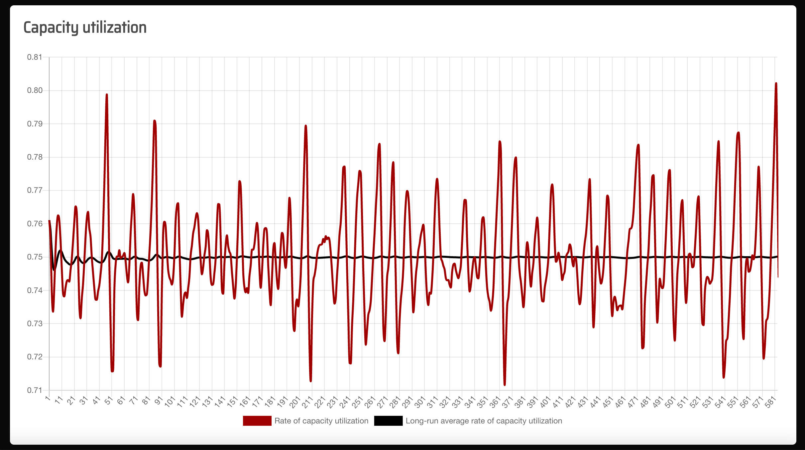
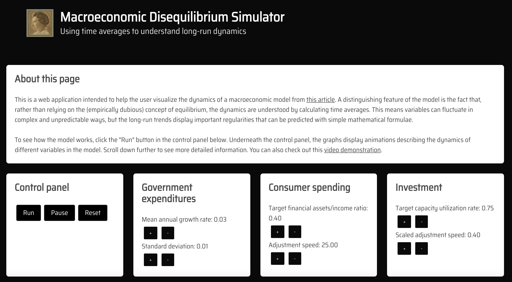
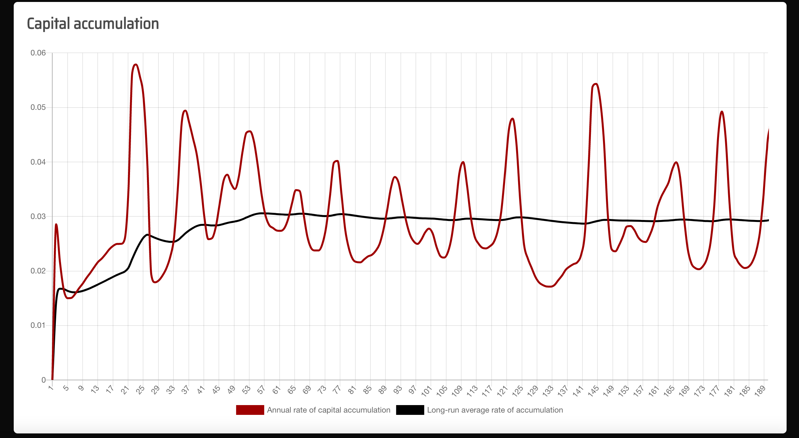

# Disequilibirum Macroeconomic Model Simulator

  Stephen Thompson (stephen.thompson@umbc.edu)

  This React.js app allows the user to choose inputs for a macroeconomic model, and then view an animation showing the results. The app solves the model using the Runge-Kutta method, and describes a disequilibrium framework in which users can understand the long-run dynamics with statistical calculations. It is based on work from an article I published in Metroeconomica, which can be found here:
  https://doi.org/10.1111/meca.12377

  

  ### Links

  A link to the deployed application can be found at [https://sthompsonchicago.github.io/macro-disequilibrium/](https://sthompsonchicago.github.io/macro-disequilibrium/). 

  Here is a quick video demonstration: [https://youtu.be/fQPoRxZOOuA](https://youtu.be/fQPoRxZOOuA).

  Here is a link to my code in a GitHub repository: [https://github.com/SThompsonChicago/macro-disequilibrium](https://github.com/SThompsonChicago/macro-disequilibrium).

  ### Description

  After loading the application in a web browswer by going to the link given above, the user will be presented with an interface, which gives options to change various parameter values. 

  

  After clicking the "Run" button, the user can scroll down to see the dynamics of the model, which are displayed as animations in the graphs below. The graphs show the rate of capital accumulation, the rate of capacity utilization, and the growth rate of government spending, as well as the long-run average values of these variables. 
  
  
  
  The user can observe that the long-run averages converge to the predicted values derived in Thompson (2022). This model provides a disequilibrium framework for understanding theories of growth driven by non-capacity-creating semi-autonomous demand, and thus builds on work by others including Serrano (1995), Allain (2015), Lavoie (2016), Fiebiger (2018), Thompson (2020) and Pérez-Montiel and Pariboni (2021)
  
  ### Contact

  My GitHub profile can be found [here](https://github.com/SThompsonChicago). You can contact me via email at s31@umbc.edu.

  ### References

  Allain, O. (2015). Tackling the instability of growth: A Kaleckian-Harrodian model with an autonomous expenditure component. Cambridge Journal of Economics, 39, 1351–1371. https://doi.org/10.1093/cje/beu039

  Fiebiger, B. (2018). Semi-autonomous household expenditures as the causa causans of postwar US business cycles: The stability and instability of Luxemburg-type external markets. Cambridge Journal of Economics, 42, 155– 175. https://doi.org/10.1093/cje/bex019

  Lavoie, M. (2016). Convergence towards the normal rate of capacity utilization in neo- Kaleckian models: The role of non-capacity creating autonomous expenditures. Metroeconomica, 67, 172–201. https://doi.org/10.1111/ meca.12305

  Pérez-Montiel, J. A., & Pariboni, R. (2021). Housing is NOT ONLY the business cycle: A Luxemburg-Kalecki external market empirical investigation for the United States. Review of Political Economy. https://doi.org/10.1080/09538259.2020.1859718

  Thompson, S. (2020). Growth, external markets and stock–flow norms: A Luxemburg-Godley model of accumulation. Cambridge Journal of Economics, 44, 417–443. https://doi.org/10.1093/cje/bez047

  Thompson, S. (2022). "The total movement of this disorder is its order": Investment and utilization dynamics in long-run disequilibrium. Appearing in Metroeconomica. https://onlinelibrary.wiley.com/doi/10.1111/meca.12377

  

